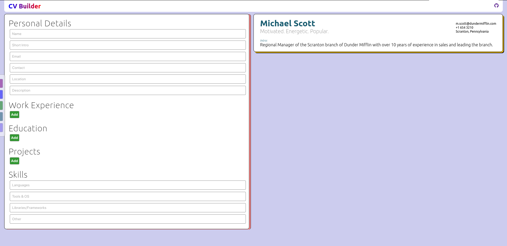

# CV-Builder

React CV Builder is a web application that allows you to create and manage your professional CV with ease. It provides a user-friendly interface to input your personal details, educational background, work experience, projects, and skills, and then view and edit your CV in real-time.



## Features

- Create and edit your CV with various sections, including personal information, education, work experience, projects, and skills.
- Real-time preview of your CV.
- Responsive and user-friendly design.
- Easily add, update, or delete details in each section of your CV.
- Customize the color theme of your CV using the Color Changer tool.

## Usage

### Getting Started

1. Clone this repository:

   ```bash
   git clone https://github.com/asdhamidi/CV-Builder/.git
   ```

2. Install project dependencies:

   ```bash
   cd CV-Builder
   npm install
   ```

3. Start the application:

   ```bash
   npm start
   ```

4. Access the application in your web browser at [http://localhost:3000](http://localhost:3000).

### Components

The project structure includes the following components:

- `editorComponents` (Directory)
- `previewComponents` (Directory)
- `colorChanger.js`
- `editor.js`
- `preview.js`
- `topbar.js`

The main functionality is in `editor.js`, where you can update your CV details and see real-time changes in the preview.

### Editor

The `Editor` component allows you to manage your CV sections. Here's how each section works:

- **Personal**: Update your personal information.
- **Work**: Add or edit your work experience.
- **Edu**: Add or edit your educational background.
- **Projects**: Add or edit your projects.
- **Skills**: Update your skills, including languages, tools, libraries, and other skills.

### Preview

The `Preview` component displays your CV in real-time, reflecting the changes you make in the editor.

### Color Changer

The `Color Changer` component lets you customize the color theme of your CV.

## Tech Stack

- React for building the web application.
- State management to store and update CV data.
- CSS for styling and responsiveness.

## Contributing

Contributions to this project are welcome! If you find any issues or have suggestions for improvements, please create a GitHub issue or submit a pull request.

## License

This project is licensed under the MIT License. See the [LICENSE](LICENSE) file for details.


Try it out at: https://asdhamidi.github.io/CV-Builder/
